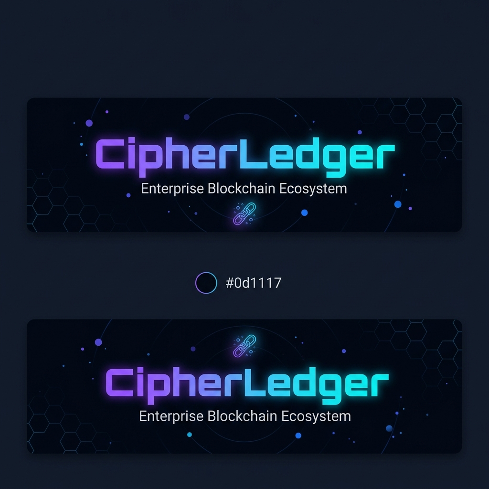

# CipherLedger

<div align="center">



<p>
  
  
  
  
  
</p>

<p>
  
  
  
</p>

**CipherLedger** is a modular blockchain platform built with **Java 21**, **Spring Boot**, and a modern React-based UI.
It includes a blockchain node, smart-contract execution, token/NFT tooling, SDKs, containerized deployment, and monitoring support.

</div>

---

## Overview

CipherLedger brings together the core pieces needed for a blockchain application in one repository:

- a Spring Boot backend node with REST and WebSocket APIs
- blockchain, mining, transaction, wallet, network, and storage modules
- smart-contract execution support through a custom VM layer
- a React UI explorer and dashboard
- Java and JavaScript SDKs for external integrations
- Docker, Kubernetes, and observability assets for deployment

If you want the short version: it is a full-stack blockchain playground with room to grow, not just a single service with a fancy hat.

---

## Repository layout

| Path | Purpose |
| --- | --- |
| `src/` | Main Java application and tests |
| `cipherledger-ui/` | React + Vite frontend |
| `cipherledger-java-sdk/` | Official Java SDK |
| `cipherledger-js-sdk/` | Official JavaScript SDK |
| `cipherledger-wallet-extension/` | Browser wallet extension |
| `docs/` | Architecture, consensus, API, deployment, and feature docs |
| `k8s/` | Kubernetes manifests |
| `config/` | Prometheus and Logstash configuration |
| `docker-compose*.yml` | Local, multi-node, and monitoring setups |

---

## Key capabilities

- **Blockchain node** with REST, WebSocket, and P2P networking support
- **Consensus implementations** for different deployment styles
- **Smart-contract execution** using a custom VM layer
- **Wallet and transaction flows** for account and asset management
- **Native token and NFT tooling** documented in the repo
- **Frontend explorer** for dashboards, transactions, nodes, and wallet views
- **SDKs and extension** for integrating CipherLedger into other apps and browsers
- **Monitoring stack** for metrics and log visibility

---

## Tech stack

### Backend

- Java 21
- Spring Boot 3.5.x
- Spring Web, Security, WebSocket
- Spring Data MongoDB
- Spring Data Redis
- Spring Boot Actuator
- Maven

### Frontend

- React
- Vite
- React Router
- Axios
- Tailwind CSS

### Infrastructure

- Docker / Docker Compose
- Kubernetes
- Prometheus
- Grafana
- Logstash / Elasticsearch / Kibana support

---

## Prerequisites

Make sure you have:

- **Java 21**
- **Maven 3.8+**
- **Node.js 18+**
- **Docker Desktop** or Docker Engine with Compose v2
- **MongoDB** and **Redis** for local backend runs

---

## Run locally

### 1) Start the backend

From the repository root:

```bash
mvn clean test
mvn spring-boot:run
```

The backend listens on **http://localhost:8080** by default.

### 2) Start the UI

```bash
cd cipherledger-ui
npm install
npm run dev
```

The frontend runs on **http://localhost:5173**.

### 3) Build the SDKs

```bash
cd cipherledger-java-sdk
mvn clean install
```

```bash
cd cipherledger-js-sdk
npm install
```

---

## Docker

### Single-node local stack

Build the backend JAR first, then bring the stack up:

```bash
mvn clean package -DskipTests
docker compose up --build
```

This starts:

- MongoDB on `27017`
- backend on `8080`
- frontend on `5173`

### Multi-node blockchain network

```bash
mvn clean package -DskipTests
docker compose -f docker-compose.multi-node.yml up --build
```

### Monitoring stack

```bash
docker compose -f docker-compose.monitoring.yml up -d
```

Typical observability endpoints:

- Grafana: `http://localhost:3000`
- Prometheus: `http://localhost:9090`
- Elasticsearch: `http://localhost:9200`
- Kibana: `http://localhost:5601`

---

## Configuration

The backend defaults are defined in `src/main/resources/application.properties`:

- `server.port=8080`
- MongoDB connection can be overridden with `SPRING_DATA_MONGODB_URI`
- Redis defaults to `localhost:6379`
- P2P defaults to port `9000`

Example override for MongoDB:

```bash
SPRING_DATA_MONGODB_URI=mongodb://localhost:27017/cipherledger
```

For multi-node runs, the compose files also set P2P seed settings per node.

---

## API and docs

Useful starting points:

- `docs/api_reference.md` — REST and WebSocket endpoint reference
- `docs/architecture.md` — system design and module overview
- `docs/consensus.md` — consensus modes and behavior
- `docs/smart_contracts.md` — smart-contract and VM details
- `docs/nfts_and_tokens.md` — token and NFT documentation
- `docs/deployment.md` — Docker, Compose, and Kubernetes deployment notes

You can also use `test.http` for quick API experiments from VS Code.

---

## Suggested workflow

1. Start MongoDB and Redis, or run the Docker stack.
2. Launch the backend.
3. Start the UI.
4. Open the explorer and verify blocks, wallets, and transactions.
5. Use the SDKs or wallet extension for integration tests.

---

## Contributing

Contributions are welcome.

1. Fork the repository
2. Create a feature branch
3. Make your changes
4. Run tests and checks
5. Open a pull request

If you add new features, please update the relevant docs in `docs/` as well.

---

## License

This project is licensed under the [MIT License](LICENSE).

---

<div align="center">

Built with Java, Spring Boot, React, and a healthy amount of blockchain curiosity.

</div>